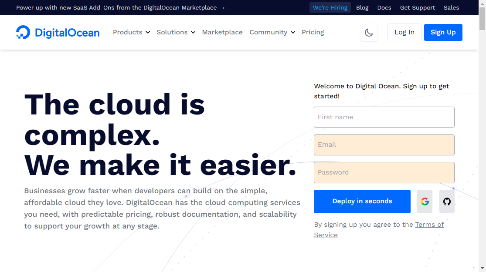

# DigitalOcean UI Clon
DigitalOcean's Main Page UI Clon

## Installation
1. Clone a copy of the repository to your local machine.
```bash
git clone git@github.com:ariel96carp/DigitalOcean-Clon.git
```

2. Use the package npm to install dependencies.
```bash
npm i
```

3. Run this repository on local environment.
```bash
npm run dev
```

4. ***[optional]*** You can build a dist with the command:
```bash
npm run production
```

## Overview

.png)
.png)
.png)
.png)
.png)
.png)

## Deploy
[https://digitalocean-clon.netlify.app](https://digitalocean-clon.netlify.app)
